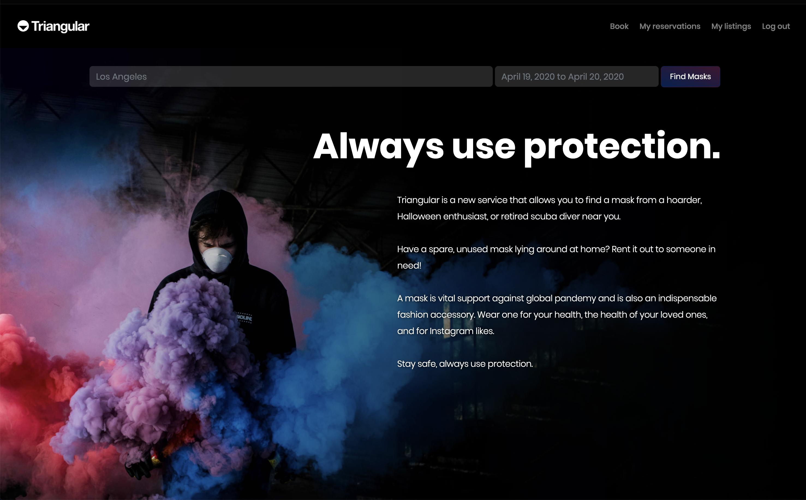

# Welcome to Triangular

This is a marketplace that allows people in need of masks to meet people who have extra ones, in this period of need!

The team: [leomarseo](https://github.com/LeoMarseo), [khk271](https://github.com/khk271), [giaro710](https://github.com/giaro710), [flazzarin](https://github.com/flazzarin), [stephdinu](https://github.com/stephdinu). Special thanks to [Luigi](https://github.com/dub-G) for the amazing help building this app.

The project was built during our 7th week of Le Wagon coding bootcamp, as an exercise in sight of the real project which will occupy our last two weeks. Turns out that this small project is pretty damn cool itself, so [check it out!](https://lw-triangular.herokuapp.com/pages/home)

Ruby version: 2.6.5
